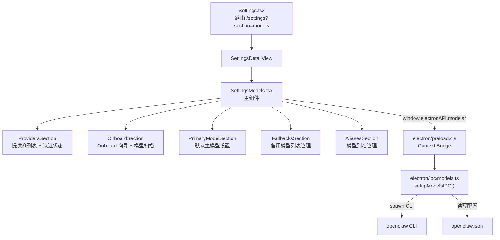
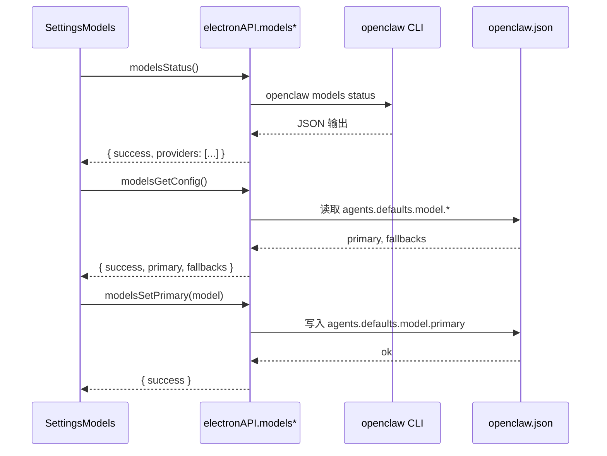

# 技术设计文档：model-providers-config

## 概述

本功能在 OpenClaw Desktop 的 Settings 页面新增独立的"模型配置"（Models）分区，路由为 `/settings?section=models`。

该分区允许用户：
- 查看所有 LLM 提供商及其认证状态
- 通过 GUI 触发 `openclaw onboard` 和 `openclaw models scan`
- 设置默认主模型（`agents.defaults.model.primary`）
- 管理备用模型列表（`agents.defaults.model.fallbacks`）
- 管理模型别名（`openclaw models aliases`）

整体遵循现有 Settings 架构约定：`sections.tsx` 注册、`constants.ts` 配色、Electron IPC 通信、`useI18n()` 国际化。

---

## 架构

### 组件关系图



### 数据流概览



---

## 组件与接口

### SettingsModels（主组件）

文件：`src/pages/SettingsModels.tsx`

职责：
- 页面级状态管理（认证状态、主模型、备用列表、别名列表）
- 页面挂载时并行加载：`modelsStatus()`、`modelsGetConfig()`、`modelsAliasesList()`
- 将加载状态、数据、操作回调分发给各子区块

```typescript
// 主组件状态结构
interface SettingsModelsState {
  // 提供商认证状态
  providerStatuses: Record<string, ProviderAuthStatus>;
  statusLoading: boolean;
  statusError: string;

  // 主模型
  primaryModel: string;
  primaryModelDraft: string;
  primaryModelSaving: boolean;
  primaryModelError: string;

  // 备用模型
  fallbacks: string[];
  fallbacksLoading: boolean;

  // 别名
  aliases: ModelAlias[];
  aliasesLoading: boolean;

  // 操作状态
  onboardRunning: boolean;
  scanRunning: boolean;
  scanResult: string;
}
```

### 子组件划分

| 组件 | 文件位置（建议） | 职责 |
|------|----------------|------|
| `ProvidersSection` | 内联于 SettingsModels | 渲染静态提供商列表，叠加运行时认证状态徽章 |
| `OnboardSection` | 内联于 SettingsModels | Onboard 向导按钮 + 模型扫描按钮 + 扫描结果展示 |
| `PrimaryModelSection` | 内联于 SettingsModels | 主模型输入框、格式校验、保存 |
| `FallbacksSection` | 内联于 SettingsModels | 备用模型列表展示、添加、删除 |
| `AliasesSection` | 内联于 SettingsModels | 别名键值对展示、添加、删除、覆盖确认 |

> 所有子区块均以 `GlassCard` 包裹，与 `SettingsAdvanced.tsx` 风格保持一致。

---

## IPC 接口设计

### 新增 IPC 方法（`electron/ipc/models.ts`）

```typescript
// 导出入口
export function setupModelsIPC(ipcMain: Electron.IpcMain): void

// ── 认证状态 ──────────────────────────────────────────────────────────────
// 执行 openclaw models status，返回各提供商认证状态
ipcMain.handle('models:status', async () => ModelsStatusResult)

// ── Onboard / Scan ────────────────────────────────────────────────────────
// 在系统终端启动 openclaw onboard（交互式，不捕获输出）
ipcMain.handle('models:onboard', async () => BasicSuccessResult)

// 执行 openclaw models scan，返回扫描输出文本
ipcMain.handle('models:scan', async () => ModelsScanResult)

// ── 配置读写 ──────────────────────────────────────────────────────────────
// 读取 agents.defaults.model.primary 和 agents.defaults.model.fallbacks
ipcMain.handle('models:getConfig', async () => ModelsConfigResult)

// 写入 agents.defaults.model.primary
ipcMain.handle('models:setPrimary', async (_, model: string) => BasicSuccessResult)

// 追加一个备用模型
ipcMain.handle('models:fallbackAdd', async (_, model: string) => BasicSuccessResult)

// 移除一个备用模型
ipcMain.handle('models:fallbackRemove', async (_, model: string) => BasicSuccessResult)

// 清空备用模型列表
ipcMain.handle('models:fallbackClear', async () => BasicSuccessResult)

// ── 别名管理 ──────────────────────────────────────────────────────────────
// 执行 openclaw models aliases list，返回别名列表
ipcMain.handle('models:aliasesList', async () => ModelsAliasesListResult)

// 执行 openclaw models aliases add <alias> <model>
ipcMain.handle('models:aliasAdd', async (_, alias: string, model: string) => BasicSuccessResult)

// 执行 openclaw models aliases remove <alias>
ipcMain.handle('models:aliasRemove', async (_, alias: string) => BasicSuccessResult)
```

### 返回类型定义（新增至 `src/types/electron.ts`）

```typescript
/** 单个提供商的认证状态 */
export type ProviderAuthStatus = 'authenticated' | 'unauthenticated' | 'unknown';

/** models:status 返回结果 */
export interface ModelsStatusResult {
  success: boolean;
  /** key 为提供商 id（与静态列表 PROVIDER_LIST 中的 id 对应） */
  providers: Record<string, ProviderAuthStatus>;
  error?: string;
}

/** models:scan 返回结果 */
export interface ModelsScanResult {
  success: boolean;
  output?: string;
  error?: string;
}

/** models:getConfig 返回结果 */
export interface ModelsConfigResult {
  success: boolean;
  primary?: string;
  fallbacks?: string[];
  error?: string;
}

/** models:aliasesList 返回结果 */
export interface ModelsAliasesListResult {
  success: boolean;
  /** key 为别名，value 为 provider/model */
  aliases: Record<string, string>;
  error?: string;
}

/** 单条别名（UI 展示用） */
export interface ModelAlias {
  alias: string;
  target: string;
}
```

### `window.electronAPI` 扩展（`electron/preload.cjs` + `src/types/electron.ts`）

```typescript
// 在 ElectronAPI interface 中新增：
modelsStatus: () => Promise<ModelsStatusResult>;
modelsOnboard: () => Promise<BasicSuccessResult>;
modelsScan: () => Promise<ModelsScanResult>;
modelsGetConfig: () => Promise<ModelsConfigResult>;
modelsSetPrimary: (model: string) => Promise<BasicSuccessResult>;
modelsFallbackAdd: (model: string) => Promise<BasicSuccessResult>;
modelsFallbackRemove: (model: string) => Promise<BasicSuccessResult>;
modelsFallbackClear: () => Promise<BasicSuccessResult>;
modelsAliasesList: () => Promise<ModelsAliasesListResult>;
modelsAliasAdd: (alias: string, model: string) => Promise<BasicSuccessResult>;
modelsAliasRemove: (alias: string) => Promise<BasicSuccessResult>;
```

---

## 数据模型

### 提供商静态定义

前端维护一份静态提供商列表（`src/pages/SettingsModels.tsx` 内或独立 `src/config/providers.ts`），运行时与 `modelsStatus()` 返回的状态合并渲染。

```typescript
export interface ProviderDefinition {
  /** 与 openclaw models status 输出中的 key 对�� */
  id: string;
  /** 显示名称 */
  name: string;
  /** 分类：llm | transcription */
  category: 'llm' | 'transcription';
  /** 简短描述（括号内内容） */
  description?: string;
}

export const PROVIDER_LIST: ProviderDefinition[] = [
  // ── LLM 提供商（23 个）────────────────────────────────────────────────
  { id: 'amazon-bedrock',       name: 'Amazon Bedrock',          category: 'llm' },
  { id: 'anthropic',            name: 'Anthropic',               category: 'llm', description: 'API + Claude Code CLI' },
  { id: 'cloudflare-ai',        name: 'Cloudflare AI Gateway',   category: 'llm' },
  { id: 'glm',                  name: 'GLM models',              category: 'llm' },
  { id: 'huggingface',          name: 'Hugging Face',            category: 'llm', description: 'Inference' },
  { id: 'kilocode',             name: 'Kilocode',                category: 'llm' },
  { id: 'litellm',              name: 'LiteLLM',                 category: 'llm', description: 'unified gateway' },
  { id: 'minimax',              name: 'MiniMax',                 category: 'llm' },
  { id: 'mistral',              name: 'Mistral',                 category: 'llm' },
  { id: 'moonshot',             name: 'Moonshot AI',             category: 'llm', description: 'Kimi + Kimi Coding' },
  { id: 'nvidia',               name: 'NVIDIA',                  category: 'llm' },
  { id: 'ollama',               name: 'Ollama',                  category: 'llm', description: 'local models' },
  { id: 'openai',               name: 'OpenAI',                  category: 'llm', description: 'API + Codex' },
  { id: 'opencode',             name: 'OpenCode',                category: 'llm', description: 'Zen + Go' },
  { id: 'openrouter',           name: 'OpenRouter',              category: 'llm' },
  { id: 'qianfan',              name: 'Qianfan',                 category: 'llm' },
  { id: 'qwen',                 name: 'Qwen',                    category: 'llm', description: 'OAuth' },
  { id: 'together-ai',          name: 'Together AI',             category: 'llm' },
  { id: 'vercel-ai',            name: 'Vercel AI Gateway',       category: 'llm' },
  { id: 'venice',               name: 'Venice',                  category: 'llm', description: 'privacy-focused' },
  { id: 'vllm',                 name: 'vLLM',                    category: 'llm', description: 'local models' },
  { id: 'xiaomi',               name: 'Xiaomi',                  category: 'llm' },
  { id: 'zai',                  name: 'Z.AI',                    category: 'llm' },
  // ── 转录提供商（2 个）────────────────────────────────────────────────
  { id: 'deepgram',             name: 'Deepgram',                category: 'transcription', description: 'audio transcription' },
  { id: 'claude-max-proxy',     name: 'Claude Max API Proxy',    category: 'transcription' },
];
```

**状态合并策略**：

```typescript
// 渲染时将静态定义与运行时状态合并
const mergedProviders = PROVIDER_LIST.map(p => ({
  ...p,
  // 若 status 中无对应 key，则标记为 'unknown'
  authStatus: providerStatuses[p.id] ?? 'unknown',
}));
```

### `provider/model` 格式校验

```typescript
/** 校验 provider/model 格式：非空、包含 /、/ 前后均非空 */
export function isValidModelFormat(value: string): boolean {
  const parts = value.trim().split('/');
  return parts.length >= 2 && parts[0].trim() !== '' && parts.slice(1).join('/').trim() !== '';
}
```

### 路由注册变更

**`src/pages/settings/sections.tsx`** — 新增 `models` 条目：

```typescript
import { Bot } from 'lucide-react';
import SettingsModels from '../SettingsModels';

// 在 channels 之后插入：
{
  id: 'models',
  name: t('settings.models'),
  description: t('settings.modelsDescription'),
  icon: Bot,
  component: SettingsModels,
  translateKey: 'models',
},
```

**`src/pages/settings/constants.ts`** — 新增配色：

```typescript
models: {
  bg:   'rgba(99, 102, 241, 0.12)',
  icon: '#818CF8',
  glow: 'rgba(129, 140, 248, 0.22)',
},
```

---

## i18n Key 规划

在 `src/i18n/translations.ts` 的 `en` 和 `zh` 对象中新增以下键值：

```typescript
// Settings 分区入口
'settings.models'                          // "Models" / "模型配置"
'settings.modelsDescription'               // "Manage LLM providers, models and aliases" / "管理 LLM 提供商、模型与别名"

// 提供商列表区块
'settings.models.providers'               // "Providers" / "提供商"
'settings.models.providersDescription'    // "Authentication status for all supported providers" / "所有支持提供商的认证状态"
'settings.models.refreshStatus'           // "Refresh Status" / "刷新状态"
'settings.models.statusAuthenticated'     // "Authenticated" / "已认证"
'settings.models.statusUnauthenticated'   // "Not authenticated" / "未认证"
'settings.models.statusUnknown'           // "Unknown" / "未知"
'settings.models.statusLoadError'         // "Failed to load provider status" / "加载提供商状态失败"
'settings.models.categoryLlm'            // "LLM Providers" / "LLM 提供商"
'settings.models.categoryTranscription'  // "Transcription Providers" / "转录��供商"

// Onboard / Scan 区块
'settings.models.actions'                 // "Actions" / "操作"
'settings.models.runOnboard'              // "Run Onboard Wizard" / "运行 Onboard 向导"
'settings.models.runOnboardDescription'   // "Launch the interactive onboarding wizard to authenticate providers" / "启动交互式向导完成提供商认证"
'settings.models.onboardRunning'          // "Onboard wizard is running..." / "Onboard 向导运行中..."
'settings.models.onboardSuccess'          // "Onboard wizard completed" / "Onboard 向导已完成"
'settings.models.onboardError'            // "Failed to start onboard wizard" / "启动 Onboard 向导失败"
'settings.models.scanModels'              // "Scan Available Models" / "扫描可用模型"
'settings.models.scanModelsDescription'   // "Discover all models available in the current environment" / "发现当前环境中所有可用模型"
'settings.models.scanRunning'             // "Scanning..." / "扫描中..."
'settings.models.scanSuccess'             // "Scan completed" / "扫描完成"
'settings.models.scanError'               // "Scan failed" / "扫描失败"
'settings.models.scanResult'              // "Scan Result" / "扫描结果"

// 主模型区块
'settings.models.primaryModel'            // "Primary Model" / "默认主模型"
'settings.models.primaryModelDescription' // "Default model used by agents (format: provider/model)" / "智能体使用的默认模型（格式：provider/model）"
'settings.models.primaryModelPlaceholder' // "e.g. anthropic/claude-opus-4-6" / "例如 anthropic/claude-opus-4-6"
'settings.models.primaryModelSave'        // "Save" / "保存"
'settings.models.primaryModelSaved'       // "Primary model saved" / "主模型已保存"
'settings.models.primaryModelSaveError'   // "Failed to save primary model" / "保存主模型失败"
'settings.models.primaryModelFormatError' // "Invalid format. Use provider/model (e.g. anthropic/claude-opus-4-6)" / "格式无效，请使用 provider/model 格式（例如 anthropic/claude-opus-4-6）"

// 备用模型区块
'settings.models.fallbacks'               // "Fallback Models" / "备用模型列表"
'settings.models.fallbacksDescription'    // "Models used when the primary model is unavailable" / "主模型不可用时自动切换的备用模型"
'settings.models.fallbackAdd'             // "Add Fallback" / "添加备用模型"
'settings.models.fallbackPlaceholder'     // "e.g. openai/gpt-4o" / "例如 openai/gpt-4o"
'settings.models.fallbackEmpty'           // "No fallback models configured" / "暂无备用模型"
'settings.models.fallbackDuplicate'       // "This model is already in the fallback list" / "该模型已在备用列表中"
'settings.models.fallbackFormatError'     // "Invalid format. Use provider/model" / "格式无效，请使用 provider/model 格式"
'settings.models.fallbackRemoveConfirm'   // "Remove this fallback model?" / "确认移除该备用模型？"

// 别名区块
'settings.models.aliases'                 // "Model Aliases" / "模型别名"
'settings.models.aliasesDescription'      // "Short names that map to full provider/model strings" / "映射到完整 provider/model 的自定义短名"
'settings.models.aliasAdd'                // "Add Alias" / "添加别名"
'settings.models.aliasName'               // "Alias name" / "别名名称"
'settings.models.aliasTarget'             // "Target model (provider/model)" / "目标模型（provider/model）"
'settings.models.aliasEmpty'              // "No aliases configured" / "暂无别名"
'settings.models.aliasDuplicate'          // "Alias already exists. Overwrite?" / "别名已存在，是否覆盖？"
'settings.models.aliasFormatError'        // "Target must be in provider/model format" / "目标必须为 provider/model 格式"
'settings.models.aliasRemoveConfirm'      // "Remove this alias?" / "确认移除该别名？"
```

---

## 正确性属性

*属性（Property）是在系统所有合法执行中应始终成立的特征或行为——本质上是对系统应做之事的形式化描述。属性在人类可读规范与机器可验证正确性保证之间架起桥梁。*

### Property 1：提供商列表字段完整性

*对于* `PROVIDER_LIST` 中的任意提供商条目，该条目必须包含非空的 `id`、`name` 字段，且 `category` 必须为 `'llm'` 或 `'transcription'` 之一。

**Validates: Requirements 1.1, 1.2**

---

### Property 2：状态合并正确性

*对于* 任意提供商状态映射 `providerStatuses: Record<string, ProviderAuthStatus>`，将其与 `PROVIDER_LIST` 合并后，每个提供商条目的 `authStatus` 应等于 `providerStatuses[p.id]`；若映射中无对应 key，则应为 `'unknown'`。

**Validates: Requirements 1.3, 1.4, 2.2**

---

### Property 3：CLI 错误响应包含失败标志

*对于* 任意 openclaw CLI 命令返回非零退出码的情况，IPC 层返回的结果对象的 `success` 字段必须为 `false`，且必须包含非空的 `error` 字段。

**Validates: Requirements 2.5, 3.5, 7.5**

---

### Property 4：`provider/model` 格式校验

*对于* 任意字符串输入，`isValidModelFormat(value)` 的返回值应当满足：
- 若字符串包含至少一个 `/`，且 `/` 前后子串均非空（去除首尾空格后），则返回 `true`
- 否则（空串、纯空白、不含 `/`、`/` 前或后为空串）返回 `false`

**Validates: Requirements 4.4, 5.4, 6.5**

---

### Property 5：主模型配置 round-trip

*对于* 任意合法的 `provider/model` 格式字符串，调用 `modelsSetPrimary(model)` 成功后，再调用 `modelsGetConfig()` 所返回的 `primary` 值应与写入值相等。

**Validates: Requirements 4.3, 4.7**

---

### Property 6：备用模型添加后列表包含该条目

*对于* 任意不含重复项的备用模型列表和任意合法的 `provider/model` 字符串（该字符串不在列表中），调用 `modelsFallbackAdd(model)` 成功后，列表长度应增加 1，且列表中包含该条目。

**Validates: Requirements 5.2**

---

### Property 7：备用模型删除后列表不含该条目

*对于* 任意含有至少一个条目的备用模型列表，调用 `modelsFallbackRemove(model)` 成功后，列表中不应再包含该条目，且列表长度减少 1。

**Validates: Requirements 5.3**

---

### Property 8：备用模型去重（幂等添加）

*对于* 任意备用模型列表和任意已在列表中存在的 `provider/model` 字符串，尝试再次添加该条目时应被拒绝（前端阻止提交），列表保持不变。

**Validates: Requirements 5.5**

---

### Property 9：别名添加 round-trip

*对于* 任意合法的别名名称和合法格式的目标 `provider/model`，调用 `modelsAliasAdd(alias, target)` 成功后，调用 `modelsAliasesList()` 所返回的映射中应包含键 `alias` 且其值等于 `target`。

**Validates: Requirements 6.2, 6.4**

---

### Property 10：别名删除后不再存在

*对于* 任意已存在的别名 `alias`，调用 `modelsAliasRemove(alias)` 成功后，调用 `modelsAliasesList()` 所返回的映射中不应再包含键 `alias`。

**Validates: Requirements 6.3**

---

## 错误处理

### IPC 层（`electron/ipc/models.ts`）

| 场景 | 处理方式 |
|------|---------|
| CLI 进程启动失败（命令不存在） | 捕获异常，返回 `{ success: false, error: err.message }` |
| CLI 返回非零退出码 | 解析 stderr，返回 `{ success: false, error: stderrText }` |
| JSON 解析失败（状态输出格式异常） | 返回 `{ success: false, error: 'Invalid JSON output' }`，同时将所有提供商标记为 `'unknown'` |
| 配置文件读取失败 | 返回 `{ success: false, error: err.message }` |
| 配置文件写入失败（权限、磁盘等） | 返回 `{ success: false, error: err.message }` |
| `modelsOnboard` 终端启动失败 | 返回 `{ success: false, error: err.message }` |

### UI 层（`src/pages/SettingsModels.tsx`）

| 场景 | 处理方式 |
|------|---------|
| `modelsStatus()` 失败 | 显示错误提示 banner，所有提供商显示"状态未知"徽章 |
| `modelsGetConfig()` 失败 | 输入框显示空值，页面顶部显示加载错误提示 |
| 格式校验失败（主模型/备用/别名目标） | 输入框下方显示行内错误说明，阻止提交 |
| 重复添加备用模型 | 输入框下方显示"已在列表中"提示，阻止提交 |
| 别名已存在 | 弹出覆盖确认，用户取消则保留原值 |
| 任意 IPC 操作失败 | 操作区域显示错误消息（4 秒后自动消失，与 `SettingsAdvanced` 保持一致） |

### 加载状态规则

- 页面挂载后，`statusLoading`、配置加载、别名加载三个异步操作并行执行（`Promise.all`）
- 任意操作进行中时，对应操作按钮 `disabled`
- `onboardRunning` 为 `true` 时，同时禁用 Onboard 和刷新状态按钮（onboard 完成后会触发状态刷新）

---

## 测试策略

### 双轨测试方法

**单元测试**（具体示例与边界情况）和**属性测试**（普遍性规则）互补使用，共同保障覆盖率。

### 单元测试重点

使用 Vitest + React Testing Library，覆盖以下场景：

```
// 路由注册
- sections 数组中存在 id 为 'models' 的条目（需求 8.1，8.3）
- sectionAccentMap 中存在 'models' 键（需求 8.2）

// UI 存在性与初始状态
- 页面挂载后渲染"运行 Onboard 向导"按钮（需求 3.1）
- 页面挂载后渲染"扫描可用模型"按钮（需求 7.1）
- 页面挂载后渲染主模型输入框及格式说明（需求 4.1, 4.2）
- statusLoading=true 时"刷新状态"按钮 disabled（需求 2.4）
- onboardRunning=true 时 Onboard 按钮 disabled（需求 3.3）
- scanRunning=true 时扫描按钮 disabled（需求 7.3）

// 错误 edge-case
- modelsStatus 失败时所有提供商状态为 'unknown'（需求 1.4）
- Onboard 启动失败时显示错误信息（需求 3.5）
- 配置写入失败时保留用户输入（需求 4.6）
- 扫描失败时显示错误详情（需求 7.5）
```

### 属性测试重点

使用 **fast-check**（TypeScript 生态主流 PBT 库），每个属性测试最少运行 **100 次**迭代。

```typescript
// 标注格式：Feature: model-providers-config, Property {N}: {描述}

// Property 1 — 提供商列表字段完整性
// Feature: model-providers-config, Property 1: provider list field completeness
test('PROVIDER_LIST 每个条目字段完整', () => {
  fc.assert(
    fc.property(fc.constantFrom(...PROVIDER_LIST), (p) => {
      expect(p.id).toBeTruthy();
      expect(p.name).toBeTruthy();
      expect(['llm', 'transcription']).toContain(p.category);
    }),
    { numRuns: 100 }
  );
});

// Property 2 — 状态合并正确性
// Feature: model-providers-config, Property 2: status merge correctness
test('状态合并后每个提供商 authStatus 与输入一致', () => {
  fc.assert(
    fc.property(
      fc.dictionary(
        fc.constantFrom(...PROVIDER_LIST.map(p => p.id)),
        fc.constantFrom('authenticated', 'unauthenticated', 'unknown')
      ),
      (statuses) => {
        const merged = mergeProviderStatuses(PROVIDER_LIST, statuses);
        for (const p of merged) {
          expect(p.authStatus).toBe(statuses[p.id] ?? 'unknown');
        }
      }
    ),
    { numRuns: 100 }
  );
});

// Property 4 — 格式校验
// Feature: model-providers-config, Property 4: provider/model format validation
test('isValidModelFormat 对合法输入返回 true，非法输入返回 false', () => {
  // 合法：非空 provider + / + 非空 model
  fc.assert(
    fc.property(
      fc.string({ minLength: 1 }).filter(s => s.trim() !== ''),
      fc.string({ minLength: 1 }).filter(s => s.trim() !== ''),
      (provider, model) => {
        expect(isValidModelFormat(`${provider}/${model}`)).toBe(true);
      }
    ),
    { numRuns: 100 }
  );
  // 非法：无 /、/ 前空、/ 后空、纯空白
  fc.assert(
    fc.property(
      fc.oneof(
        fc.string().filter(s => !s.includes('/')),
        fc.constant('/model'),
        fc.constant('provider/'),
        fc.constant('  '),
        fc.constant('')
      ),
      (invalid) => {
        expect(isValidModelFormat(invalid)).toBe(false);
      }
    ),
    { numRuns: 100 }
  );
});

// Property 6 — 备用模型添加
// Feature: model-providers-config, Property 6: fallback add grows list
test('添加合法备用模型后列表长度 +1 且包含该条目', () => {
  fc.assert(
    fc.property(
      fc.uniqueArray(
        fc.tuple(
          fc.string({ minLength: 1 }).filter(s => s.trim() !== ''),
          fc.string({ minLength: 1 }).filter(s => s.trim() !== '')
        ).map(([p, m]) => `${p}/${m}`)
      ),
      fc.tuple(
        fc.string({ minLength: 1 }).filter(s => s.trim() !== ''),
        fc.string({ minLength: 1 }).filter(s => s.trim() !== '')
      ).map(([p, m]) => `${p}/${m}`),
      (list, newModel) => {
        fc.pre(!list.includes(newModel));
        const result = addFallback(list, newModel);
        expect(result).toHaveLength(list.length + 1);
        expect(result).toContain(newModel);
      }
    ),
    { numRuns: 100 }
  );
});

// Property 8 — 备用模型去重幂等性
// Feature: model-providers-config, Property 8: fallback dedup idempotence
test('重复添加已存在备用模型时列表不变', () => {
  fc.assert(
    fc.property(
      fc.uniqueArray(
        fc.tuple(
          fc.string({ minLength: 1 }).filter(s => s.trim() !== ''),
          fc.string({ minLength: 1 }).filter(s => s.trim() !== '')
        ).map(([p, m]) => `${p}/${m}`),
        { minLength: 1 }
      ),
      (list) => {
        const existing = list[Math.floor(Math.random() * list.length)];
        const result = addFallback(list, existing); // addFallback 应检测重复并拒绝
        expect(result).toEqual(list);
      }
    ),
    { numRuns: 100 }
  );
});
```

### 测试文件结构建议

```
src/
  pages/
    __tests__/
      SettingsModels.unit.test.tsx   # 单元测试（UI 渲染 + 边界 edge-case）
      SettingsModels.pbt.test.ts     # 属性测试（fast-check，纯函数逻辑）
  config/
    __tests__/
      providers.pbt.test.ts          # PROVIDER_LIST 字段完整性属性测试
  utils/
    __tests__/
      modelFormat.pbt.test.ts        # isValidModelFormat 属性测试
```
