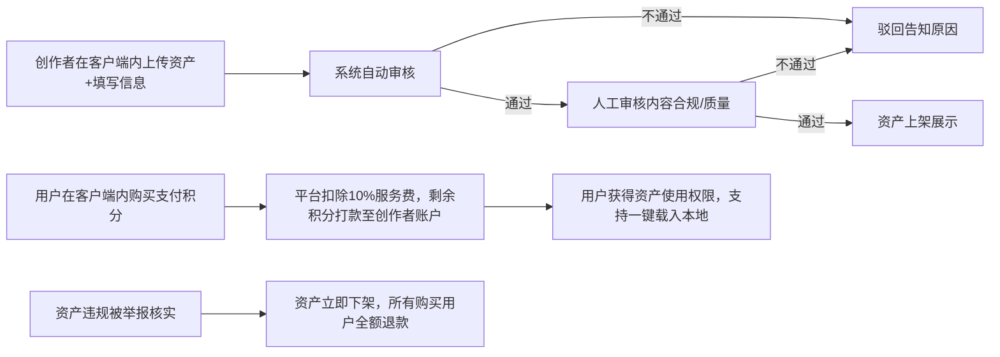

# OpenClaw Desktop v1.2 市场模块 PRD
## 一、功能定位
OpenClaw市场是OpenClaw桌面客户端v1.2版本新增的内置生态功能模块，核心定位为：
1. 降低OpenClaw能力复用成本：用户无需从零编写agent、技能、配置，可直接在客户端内下载使用社区优质资产
2. 赋能创作者变现：为有能力产出优质OpenClaw资产的用户提供积分交易通道，实现知识价值变现
3. 繁荣OpenClaw生态：构建"贡献-收益-再贡献"的正向循环，丰富生态资产池

## 二、目标用户画像
| 用户类型 | 核心需求 | 占比预估 |
|---------|---------|---------|
| 普通终端用户 | 快速获取可用的agent、技能、配置，提升工作效率 | 60% |
| 资产创作者 | 分享自己产出的优质资产，获取积分收益，建立个人影响力 | 25% |
| 企业团队用户 | 批量获取合规、经过审核的企业级资产，统一管理团队配置 | 10% |
| 生态贡献者 | 参与资产审核、社区治理，获取官方奖励积分 | 5% |

## 三、核心功能模块划分
### 3.1 资产浏览与搜索模块
- 资产分类导航：支持按资产类型（Agent/Soul配置/技能文件/模型参数/其他）、行业场景、评分、价格筛选
- 搜索功能：支持关键词搜索、标签搜索，结果支持按热度、评分、上新时间排序
- 资产详情页：展示资产介绍、预览截图、版本信息、作者信息、购买记录、用户评价

### 3.2 资产操作模块（核心能力）
- 一键载入：用户购买/获取资产后，点击即可自动将资产导入到本地OpenClaw workspace对应目录，无需手动拷贝配置
- 一键导出：用户可将本地workspace中的资产一键打包成标准格式，用于上架或分享
- 一键分享：支持生成资产分享链接，其他用户点击可直接跳转至客户端内资产详情页，支持分享到飞书、微信等渠道

### 3.3 积分交易体系模块
#### 积分获取规则
1. 日常任务：签到、完成新手引导、邀请新用户获取积分
2. 资产收益：用户上传的资产被购买后，按比例获得积分
3. 官方奖励：参与社区活动、贡献优质资产、参与审核获得官方积分奖励
4. 充值：用户可通过人民币充值兑换积分（1元=10积分）

#### 积分消费规则
1. 购买付费资产
2. 解锁资产高级功能
3. 兑换官方周边、服务权益

#### 交易核心规则
1. 平台抽成：每笔交易平台收取10%的技术服务费，创作者获得90%的积分收益
2. 退款规则：用户购买资产后7天内未下载使用可申请全额退款，下载后非资产质量问题不予退款
3. 提现规则：创作者积分满1000可申请提现，提现比例为10积分=1元，每月最多提现2次，单笔最高5000元

### 3.4 资产管理模块
- 我的资产：展示用户已购买、已上传的所有资产，支持版本更新、下架、重新编辑
- 购买记录：展示所有交易订单、消费明细、积分流水
- 创作者中心：展示资产收益数据、用户评价、提现记录

### 3.5 资产上架/审核/交易全流程

### 3.6 用户权限控制体系
| 用户角色 | 权限范围 |
|---------|---------|
| 游客 | 仅可浏览公开资产信息，不可下载、购买、上传 |
| 普通注册用户 | 可浏览所有资产、购买/下载免费/付费资产、分享资产、上传资产（需经过审核后上架） |
| 认证创作者 | 上传资产可免初审（仍需自动审核）、更高提现额度、专属创作者标识 |
| 平台管理员 | 资产审核、下架违规资产、管理用户权限、查看平台运营数据 |

## 四、迭代优先级与Roadmap（与OpenClaw Desktop迭代计划对齐）
### 优先级排序（P0 > P1 > P2）
#### P0 核心必选功能（Desktop v1.2 上线必须完成）
- 4类核心资产（Agent/Soul配置/技能文件/模型参数）的标准格式定义
- 一键载入/导出/分享核心功能
- 资产浏览、搜索、详情页基础功能
- 基础积分体系（签到、资产交易、充值）
- 自动审核机制
#### P1 重要功能（Desktop v1.3 迭代）
- 人工审核后台
- 用户评价、评分体系
- 创作者中心、提现功能
- 用户等级与权限体系
#### P2 优化功能（Desktop v1.4 迭代）
- 资产推荐算法
- 社区讨论、私信功能
- 企业级批量资产管理
- 跨平台资产同步

### 分阶段落地Roadmap
| 阶段 | 对应Desktop版本 | 上线时间 | 核心交付内容 |
|---------|---------|---------|---------|
| Phase 1 | v1.2 | 2026-03-20 | 核心基础功能上线，支持4类资产的上传、下载、一键操作，基础积分交易 |
| Phase 2 | v1.3 | 2026-04-05 | 完整审核流程、用户评价体系、创作者提现功能、权限体系落地 |
| Phase 3 | v1.4 | 2026-04-20 | 社区功能、推荐算法、企业服务能力上线，完成生态闭环 |

## 五、非功能需求
1. 性能要求：资产搜索响应时间<500ms，一键载入操作<10s完成
2. 安全要求：所有上传资产必须经过恶意代码扫描，用户数据加密存储
3. 兼容性要求：支持Windows/macOS/Linux全平台的OpenClaw桌面客户端