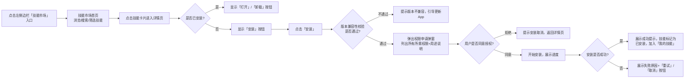

# PRD - OpenClaw Desktop 普通用户侧技能安装功能

## Meta 信息
| 字段 | 值 |
|------|----|
| project-name | openclaw-desktop |
| feature-name | skill-installation-ui（普通用户侧技能安装功能） |
| owner | product-lead（对齐哥） |
| status | draft |
| code-root | ~/.openclaw/workspace-shared/projects/openclaw-desktop/ |
| update-time | 2026-03-23 |

---

## Problem / Why
### 核心问题
当前OpenClaw的技能安装仅支持CLI命令行操作，对非技术普通用户不友好，用户无法直观浏览、搜索、安装和管理可用技能，大幅限制了技能生态的普及和使用率。
### 目标用户
所有OpenClaw桌面端普通用户，尤其是无开发背景的终端用户
### 价值主张
提供图形化的技能市场和安装流程，用户无需掌握CLI命令即可一键完成技能的搜索、安装、更新和卸载操作，降低技能使用门槛，提升生态活跃度。

---

## Solution / What
### 功能范围
#### In Scope（MVP包含）
1. 桌面端左侧边栏「技能市场」入口
2. 技能市场首页：推荐技能列表、搜索、分类筛选、排序功能
3. 技能详情页：技能完整介绍、截图、版本信息、权限说明、依赖说明
4. 一键安装全流程：权限校验、进度展示、结果反馈
5. 「我的技能」管理页：已安装技能列表、更新、卸载功能
6. 核心边界场景处理：安装失败、权限拒绝、版本不兼容、网络异常等
#### Out of Scope（MVP不包含）
1. 技能评价/打分/评论功能
2. 用户自定义上传私有技能
3. 批量安装/更新技能
4. 付费技能体系
5. 技能市场审核机制（依赖上游官方技能审核流程）

### 核心用户流程

### 界面原型说明
#### 1. 技能市场首页
- 布局：顶部搜索栏 + 分类筛选栏 + 技能卡片流
- 技能卡片内容：技能图标、名称、一句话简介、安装量、评分、「安装/已安装」按钮
- 筛选支持：按分类（生产力、开发工具、办公协作、生活服务等）、按排序（最新发布、最多安装、最高评分）
#### 2. 技能详情页
- 顶部：技能图标、名称、版本号、作者、更新时间、安装按钮
- 中部：技能详情描述、功能截图轮播、所需权限列表（每条权限附用途说明）、依赖信息
- 底部：版本历史、相关技能推荐
#### 3. 安装流程弹窗
- 权限申请弹窗：清晰列出所有权限，每条说明"该权限允许技能做什么"，用户需勾选「我同意授予以上权限」才能点击「继续安装」
- 安装进度弹窗：分段进度条（下载中→安装依赖→配置中→完成），对应阶段显示文字提示
- 结果弹窗：成功状态显示「安装完成」+「打开技能」/「返回市场」按钮；失败状态显示具体错误原因 +「重试」/「取消」按钮
#### 4. 我的技能页
- 列表展示所有已安装技能，显示名称、图标、版本号、安装时间
- 每个技能操作项：「打开」、「更新」（有新版本时显示）、「卸载」
- 卸载二次确认弹窗：提示卸载后相关数据将被清除，用户确认后执行卸载

---

## 边界场景处理逻辑
### 1. 安装进度反馈
| 安装阶段 | 进度占比 | 提示文字 |
|----------|----------|----------|
| 下载技能包 | 0% - 40% | 正在下载技能资源... |
| 安装依赖 | 40% - 70% | 正在安装依赖组件... |
| 配置权限与环境 | 70% - 95% | 正在配置技能运行环境... |
| 完成校验 | 95% - 100% | 正在完成安装... |
进度条实时更新，无卡顿，阶段切换有平滑过渡效果

### 2. 成功状态处理
- 安装完成后弹出成功toast，停留3秒自动消失
- 技能详情页「安装」按钮变为「打开」，技能市场卡片标记为「已安装」
- 技能自动加入「我的技能」列表，可立即打开使用

### 3. 失败状态处理
| 失败原因 | 提示文案 | 操作选项 |
|----------|----------|----------|
| 网络连接异常 | 网络连接失败，请检查网络后重试 | 重试 / 取消 |
| 用户拒绝权限授予 | 安装已取消，你拒绝了该技能所需的必要权限 | 确定 |
| 版本不兼容 | 该技能需要OpenClaw Desktop版本 >= v1.2.0，当前版本为v1.1.0，请先更新App | 立即更新 / 取消 |
| 依赖冲突 | 该技能与已安装的「XXX」技能存在依赖冲突，请卸载冲突技能后重试 | 查看冲突技能 / 取消 |
| 磁盘空间不足 | 磁盘空间不足，请清理空间后重试 | 确定 |
| 其他未知错误 | 安装失败，请稍后重试或联系技能作者反馈 | 重试 / 取消 |

### 4. 权限校验规则
- 所有官方上架技能的权限列表均经过审核，无超范围权限申请
- 权限申请必须明确告知用户用途，禁止模糊描述，例如：
  ✅ 飞书访问权限：允许该技能读取和发送飞书消息、查看通讯录信息
  ❌ 飞书权限：获取飞书相关能力
- 敏感权限（如消息发送、文件读写、浏览器控制等）需高亮显示，额外提示风险

---

## Success Metrics
### 核心指标
1. 技能安装成功率 >= 90%
2. 平均安装完成时长 <= 10秒
3. 技能市场访问到安装的转化率 >= 15%
### 支撑指标
1. 技能搜索结果匹配率 >= 85%
2. 权限授予通过率 >= 80%
3. 安装失败原因分布可监控（网络/权限/兼容/其他占比）
### 观测周期
功能上线后14天

---

## Constraints & Risks
1. **安全风险**：恶意技能可能申请过度权限，依赖上游官方技能审核机制保障上架技能安全，本功能仅做权限透明化展示
2. **兼容性风险**：不同技能依赖版本可能冲突，MVP阶段优先提示冲突，后续迭代支持自动冲突解决
3. **性能风险**：技能列表加载时间 <= 2秒，即使有超过100个技能上架也需保证流畅体验
4. **合规风险**：权限申请描述需符合个人信息保护相关规定，明确告知用户数据用途

---

## 功能验收标准清单
### 入口与基础页面
✅ 左侧边栏存在「技能市场」入口，点击可正常进入市场首页
✅ 「我的技能」tab可正常切换，展示已安装技能列表
✅ 无网络状态下市场页面显示「网络不可用」提示，刷新按钮可用

### 浏览与搜索
✅ 技能卡片展示信息完整：图标、名称、简介、安装量、安装状态
✅ 搜索支持关键词模糊匹配，返回结果正确
✅ 分类筛选和排序功能可用，结果符合预期
✅ 不兼容当前版本的技能安装按钮置灰，hover显示版本不兼容提示

### 安装流程
✅ 点击安装按钮首先弹出权限申请弹窗，所有权限带明确用途说明
✅ 用户拒绝授权时安装取消，提示正确
✅ 用户同意授权后进入安装流程，进度条按阶段正确更新
✅ 安装成功后提示正确，技能状态变更为已安装，出现在「我的技能」列表
✅ 安装失败时显示具体错误原因，重试按钮可重新发起安装

### 管理功能
✅ 「我的技能」列表展示信息完整：名称、版本、安装时间
✅ 卸载功能可用：点击卸载→二次确认→卸载成功，技能从列表移除
✅ 有新版本的技能显示「更新」按钮，点击可触发更新流程（复用安装逻辑）

### 边界场景
✅ 版本不兼容时正确提示并引导更新
✅ 依赖冲突时正确提示冲突技能信息
✅ 磁盘空间不足时正确提示
