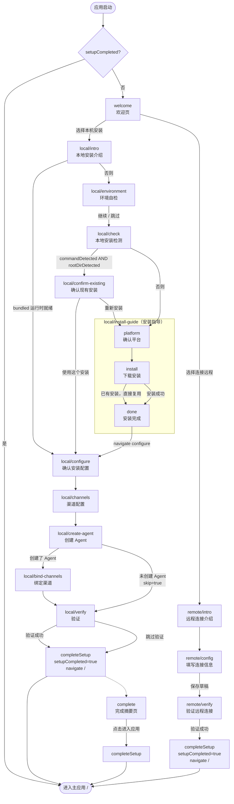

# OpenClaw Desktop — Setup 引导流程文档

> 本文档描述 OpenClaw Desktop 首次启动时的完整引导（Setup）流程，包含本地安装路径与远程连接路径的所有步骤、跳转条件及关键 IPC 调用。

---

## 一、总体概述

Setup 流程在应用首次启动（或重置后）时触发，分为两条主路径：

- **本地路径**：在当前机器上安装并配置 OpenClaw
- **远程路径**：连接到已部署好的远程 OpenClaw 服务

流程完成后，`setupCompleted` 标志写入持久化存储，后续启动直接进入主应用。

---

## 二、完整流程图



> `local/verify` 和 `remote/verify` 验证成功后直接调用 `completeSetup()` → `navigate('/')` 进入主应用，不经过 `/setup/complete`。完成摘要页用虚线表示为可选路径。

---

## 三、步骤详细说明

### 3.1 欢迎页 `/setup/welcome`

**作用**：引导用户选择安装模式。

| 操作 | 跳转目标 |
|------|---------|
| 选择"在本机安装 OpenClaw" | `/setup/local/intro` |
| 选择"连接远程 OpenClaw" | `/setup/remote/intro` |

**IPC 调用**：`selectMode(mode)` → `settingsSet({ setupMode, setupCurrentStep })`

---

### 3.2 本地安装介绍页 `/setup/local/intro`

**作用**：说明本地安装流程，检测内置运行时状态。

| 条件 | 跳转目标 |
|------|---------|
| 内置运行时（bundled）完整可用 | 直接跳到 `/setup/local/configure` |
| 否则 | `/setup/local/environment` |

**跳过逻辑**：`runtimeResolution.tier === 'bundled'` 时显示快速通道提示，按钮文字变为"开始配置"。

---

### 3.3 环境自检页 `/setup/local/environment`

**作用**：检测 Node.js、npm、OpenClaw CLI 是否满足要求，支持一键修复。

**IPC 调用**：
- `setupEnvironmentCheck()` — 获取环境检测结果
- `fixEnvironment(action)` — 一键修复（`install` / `upgrade` / `fixPath`）

**跳过条件**（导航图 skip）：
```
runtimeTier === 'bundled' && bundledNodeAvailable && bundledOpenClawAvailable
```

| 操作 | 跳转目标 |
|------|---------|
| 点击"继续" | `/setup/local/check` |
| 点击"跳过并继续" | `/setup/local/check` |

---

### 3.4 本地检测页 `/setup/local/check`

**作用**：综合命令探测、CLI 诊断、根目录诊断，判断是否存在可用安装。

**IPC 调用**（并行）：
- `detectOpenClawPath()` — 路径探测
- `diagnoseOpenClawCommand()` — CLI 诊断
- `diagnoseOpenClawRoot()` — 根目录诊断

| 检测结果 | 跳转目标 |
|---------|---------|
| 命令存在 + 根目录有效 | `/setup/local/confirm-existing` |
| 否则 | `/setup/local/install-guide` |

---

### 3.5a 确认现有安装页 `/setup/local/confirm-existing`

**作用**：展示已检测到的安装信息，让用户确认复用或重新安装。

| 操作 | 跳转目标 |
|------|---------|
| "使用这个安装" | `/setup/local/configure` |
| "重新安装或手动指定" | `/setup/local/install-guide` |

---

### 3.5b 安装指导页 `/setup/local/install-guide`

**作用**：引导用户完成 OpenClaw 的安装，包含 3 个子步骤（见第四节）。渠道、模型、workspace、gateway、daemon、skills 配置均在外层步骤完成。

**完成后跳转**：`/setup/local/configure`

---

### 3.6 确认安装配置页 `/setup/local/configure`

**作用**：展示自动识别的安装路径和根目录，用户确认后继续。

**IPC 调用**：`saveLocalConfiguration({ openclawPath, openclawRootDir })`

**跳转目标**：`/setup/local/channels`

---

### 3.7 渠道配置页 `/setup/local/channels`

**作用**：配置消息渠道账户（Telegram、Discord 等），支持多账户，可跳过。

**IPC 调用**：
- `channelListAccounts(provider)` — 查询已有账户
- `channelAddAccount(provider, config)` — 添加账户
- `channelTestConnection(provider, accountId)` — 测试连接

**跳转目标**：`/setup/local/create-agent`

---

### 3.8 创建 Agent 页 `/setup/local/create-agent`

**作用**：创建或选择一个 Agent，可跳过。

**IPC 调用**：
- `agentList()` — 查询已有 Agent
- `agentCreate(config)` — 创建新 Agent

**跳转目标**：
- 创建了 Agent → `/setup/local/bind-channels`
- 未创建 → `/setup/local/verify`（bind-channels 被跳过）

---

### 3.9 绑定渠道页 `/setup/local/bind-channels`

**作用**：将渠道账户绑定到已创建的 Agent。

**跳过条件**：`state.agent.created === null`（未创建 Agent）

**IPC 调用**：
- `agentBindChannel(agentId, channelKey, accountId)` — 绑定渠道

**跳转目标**：`/setup/local/verify`

---

### 3.10 验证页 `/setup/local/verify`

**作用**：验证 OpenClaw CLI 可用性和 Gateway 运行状态。

**IPC 调用**（顺序执行）：
1. `doctorFix()` — 自动修复配置 schema 不兼容问题
2. `gatewayRepairCompatibility()` — 深度修复（如需）
3. `testOpenClawCommand()` — 验证 CLI
4. `gatewayStatus()` — 检查 Gateway 状态
5. `gatewayStart()` — 启动 Gateway（如 stopped 或 error）
6. `gatewayStatus()` — 再次确认状态

**错误分类**（`classifyVerifyError`）：
- `gateway_failed`：连接失败、端口不可达
- `cli_failed`：CLI 命令不可用
- `unknown`：其他错误

**操作**：
- 验证通过 → `/setup/complete`
- 验证失败 → 显示结构化错误 + 修复建议，提供"跳过验证，直接进入"按钮

---

### 3.11 远程连接介绍页 `/setup/remote/intro`

**作用**：说明远程连接流程。

**跳转目标**：`/setup/remote/config`

---

### 3.12 远程配置页 `/setup/remote/config`

**作用**：填写远程服务器连接信息（host、port、protocol、token）。

**IPC 调用**：`saveRemoteDraft(draft)` → `settingsSet({ remoteHost, remotePort, ... })`

**跳转目标**：`/setup/remote/verify`

---

### 3.13 远程验证页 `/setup/remote/verify`

**作用**：测试远程 OpenClaw 连接是否可用。

**IPC 调用**：
- `remoteOpenClawTestConnection(config)` — 测试连接
- `remoteOpenClawSaveConnection(config)` — 保存连接配置（成功后）

**跳转目标**：`/setup/complete`

---

### 3.14 完成页 `/setup/complete`

**作用**：展示引导完成摘要，点击进入主应用。

**IPC 调用**：`completeSetup()` → `settingsSet({ setupCompleted: true, runMode })` → `navigate('/')`

---

## 四、安装指导页子步骤（`/setup/local/install-guide`）

安装指导页内部包含 3 个子步骤（方案 A 精简版）：

| # | 子步骤 key | 标签 | 说明 |
|---|-----------|------|------|
| 1 | `platform` | 确认平台 | 展示检测到的平台（macOS/Linux/Windows WSL2），确认后开始安装 |
| 2 | `install` | 下载安装 | 执行 `installOpenClawForSetup()`，实时显示安装进度和日志；检测到已安装版本时可选择复用 |
| 3 | `done` | 完成 | 展示安装完成确认，跳转到 `/setup/local/configure` |

**安装 IPC 调用**：
- `setupInstallOpenClaw()` — 触发自动安装
- `onInstallProgress(callback)` — 监听安装进度事件（`download` / `install` / `init` / `verify`）
- `onInstallOutput(callback)` — 监听实时日志输出

---

## 五、Bootstrapping 初始化逻辑

应用启动时，`SetupFlowProvider` 执行以下初始化：

```
1. 从 electron-store 读取持久化设置（settingsGet）
2. 恢复 setupCurrentStep（通过 restoreStep 验证路径有效性）
3. 检查 setupCompleted 标志
   - true  → 路由到主应用 /
   - false → 路由到 setupCurrentStep 或 /setup/welcome
4. 初始化 channelConfigs（createLazyChannelConfigs）
5. 解析运行时层级（runtimeResolution）
```

**持久化字段**（存储在 electron-store）：

| 字段 | 说明 |
|------|------|
| `setupCompleted` | 是否完成引导 |
| `setupMode` | `local` / `remote` |
| `setupCurrentStep` | 最后访问的步骤路径 |
| `openclawPath` | OpenClaw CLI 路径 |
| `openclawRootDir` | OpenClaw 根目录 |
| `localInstallValidated` | 本地安装是否已验证 |
| `remoteHost/Port/Protocol/Token` | 远程连接配置 |
| `remoteConnectionValidated` | 远程连接是否已验证 |
| `detectedPlatform` | 检测到的平台标识 |
| `setupInstallStatus` | 安装状态（idle/running/succeeded/failed） |

---

## 六、导航图后退逻辑

后退路径由 `setupNavigationGraph.ts` 中的 `prev` 函数决定，关键条件导航：

| 当前步骤 | 后退条件 | 后退目标 |
|---------|---------|---------|
| `/setup/local/configure` | `localInstallValidated === true` | `/setup/local/confirm-existing` |
| `/setup/local/configure` | `localInstallValidated === false` | `/setup/local/install-guide` |
| `/setup/local/verify` | `agent.created !== null` | `/setup/local/bind-channels` |
| `/setup/local/verify` | `agent.created === null` | `/setup/local/create-agent` |
| `/setup/complete` | `mode === 'remote'` | `/setup/remote/verify` |
| `/setup/complete` | `mode === 'local'` | `/setup/local/verify` |
